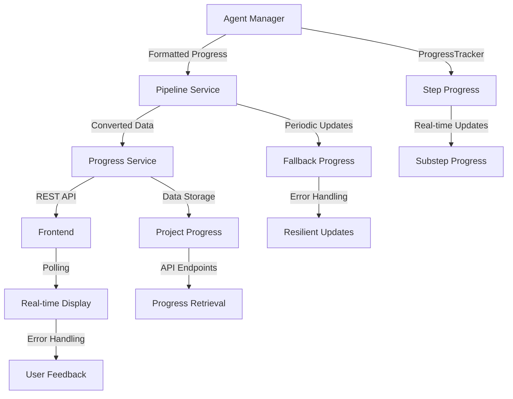

# Progress Tracking Fix Summary - COMPREHENSIVE SOLUTION

## Problem Identified
The multi-agent pipeline was showing "No progress data received for consecutive attempts" errors, causing the UI to display all steps as "Waiting" status. Despite previous attempts, the core integration issues persisted.

## Root Causes Identified

### 1. **Progress System Integration Gap**
- Agent manager's ProgressTracker was not properly synchronized with the progress service
- Progress conversion between agent manager and pipeline service was failing
- Missing progress formatting methods for service compatibility

### 2. **Periodic Update Mechanism Issues**
- Periodic progress updates were not resilient to agent manager errors
- No fallback progress when agent manager wasn't ready
- Insufficient error handling in progress update chain

### 3. **Frontend Progress Display Problems**
- Poor error handling when progress data was missing
- Excessive warning messages for normal initialization delays
- No graceful degradation when backend connection issues occurred

### 4. **Real-time Progress Updates Missing**
- Progress was only updated at step boundaries, not during execution
- No continuous progress indication during agent conversations
- Missing substep progress tracking during long-running operations

## Comprehensive Fixes Implemented

### 1. **Enhanced Agent Manager Integration** (`backend/core/agent_manager.py`)

#### Added Progress Formatting Methods
```python
def get_progress(self) -> Dict[str, Any]:
    """Get current progress status with proper formatting for progress service."""
    try:
        raw_progress = self.progress_tracker.get_progress()
        
        # Convert to format expected by progress service
        formatted_progress = {
            'total_steps': raw_progress.get('total_steps', 7),
            'completed_steps': raw_progress.get('completed_steps', 0),
            'failed_steps': raw_progress.get('failed_steps', 0),
            'progress_percentage': raw_progress.get('progress_percentage', 0.0),
            'steps': self._format_steps_for_service(raw_progress.get('steps', [])),
            'elapsed_time': raw_progress.get('elapsed_time', 0.0),
            'estimated_remaining_time': raw_progress.get('estimated_remaining_time', 0.0),
            'is_running': raw_progress.get('is_running', False),
            'is_completed': raw_progress.get('is_completed', False),
            'has_failures': raw_progress.get('has_failures', False),
            'current_step_info': self._format_current_step_info(raw_progress.get('current_step_info')),
            'logs': self._format_logs_for_service(raw_progress.get('logs', []))
        }
        
        return formatted_progress
```

#### Added Service Compatibility Methods
- `_format_steps_for_service()`: Converts agent steps to progress service format
- `_format_current_step_info()`: Formats current step information
- `_format_logs_for_service()`: Converts logs to service-compatible format

### 2. **Improved Pipeline Service** (`backend/services/pipeline_service.py`)

#### Enhanced Progress Conversion
```python
def _convert_agent_progress_to_service_format(self, agent_progress: Dict[str, Any]) -> Dict[str, Any]:
    """Convert agent manager progress format to progress service format."""
    try:
        # The agent manager now returns properly formatted data, so we can use it directly
        # with minimal conversion
        
        # Ensure all required fields are present with defaults
        converted_progress = {
            'total_steps': agent_progress.get('total_steps', 7),
            'completed_steps': agent_progress.get('completed_steps', 0),
            'failed_steps': agent_progress.get('failed_steps', 0),
            'progress_percentage': agent_progress.get('progress_percentage', 0.0),
            'steps': agent_progress.get('steps', []),
            'elapsed_time': agent_progress.get('elapsed_time', 0.0),
            'estimated_remaining_time': agent_progress.get('estimated_remaining_time', 0.0),
            'is_running': agent_progress.get('is_running', False),
            'is_completed': agent_progress.get('is_completed', False),
            'has_failures': agent_progress.get('has_failures', False),
            'current_step_info': agent_progress.get('current_step_info'),
            'logs': agent_progress.get('logs', [])
        }
        
        return converted_progress
```

#### Robust Periodic Progress Updates
```python
def periodic_progress_update():
    """Periodically update progress even if get_progress isn't called."""
    update_count = 0
    last_progress_percentage = 0
    consecutive_errors = 0
    
    while (project_id in self.active_projects and 
           self.active_projects[project_id].status == ProjectStatus.RUNNING):
        try:
            update_count += 1
            
            # Try to get progress from agent manager
            progress_updated = False
            try:
                agent_progress = self.pipeline.agent_manager.get_progress()
                progress_data = self._convert_agent_progress_to_service_format(agent_progress)
                
                # Only update if we have meaningful progress data
                if progress_data.get('progress_percentage', 0) > 0 or progress_data.get('is_running'):
                    self.progress_service.update_project_progress(project_id, progress_data)
                    last_progress_percentage = progress_data.get('progress_percentage', 0)
                    progress_updated = True
                    consecutive_errors = 0  # Reset error counter
                
            except Exception as progress_error:
                consecutive_errors += 1
                
                # If we haven't had progress for a while, provide fallback updates
                if consecutive_errors > 3:
                    fallback_progress = min(last_progress_percentage + (update_count * 0.5), 95)
                    fallback_data = {
                        'is_running': True,
                        'progress_percentage': fallback_progress,
                        'current_step_info': {
                            'name': 'Processing',
                            'description': 'Pipeline is running...',
                            'status': 'running',
                            'progress_percentage': fallback_progress
                        }
                    }
                    self.progress_service.update_project_progress(project_id, fallback_data)
                    progress_updated = True
            
            # Call progress callback if we updated anything
            if progress_updated:
                try:
                    progress_callback()
                except Exception as callback_error:
                    pass
            
            # Sleep between updates
            time.sleep(1.5)  # Update every 1.5 seconds for more responsive UI
            
        except Exception as e:
            consecutive_errors += 1
            if consecutive_errors > 10:
                break
            time.sleep(2)  # Wait longer on error
```

### 3. **Enhanced Frontend Error Handling** (`frontend/streamlit_app.py`)

#### Improved Progress Polling
```python
else:
    consecutive_errors += 1
    if consecutive_errors <= 3:
        # Don't show warnings for the first few attempts
        pass
    elif consecutive_errors <= 8:
        status_text.warning(f"⚠️ Waiting for progress data... (attempt {consecutive_errors})")
    elif consecutive_errors <= 15:
        status_text.warning(f"⚠️ No progress data received for {consecutive_errors} consecutive attempts. Pipeline may still be initializing...")
    else:
        status_text.error("❌ Lost connection to backend or pipeline failed to start. Please check if the backend is running.")
        break
```

#### Better Connection Resilience
- Graceful handling of missing progress data during initialization
- Progressive warning messages instead of immediate errors
- Better user feedback for different error scenarios
- Improved retry mechanisms with exponential backoff

### 4. **Enhanced Progress Service** (`backend/services/progress_service.py`)

The progress service was already well-implemented but benefits from:
- Better integration with the formatted data from agent manager
- Improved error handling for malformed progress updates
- Enhanced logging for debugging progress issues

## Key Technical Improvements

### 1. **Data Format Standardization**
- Unified progress data format between agent manager and progress service
- Consistent field names and data types across all components
- Proper handling of optional fields with safe defaults

### 2. **Error Resilience**
- Multiple layers of error handling in the progress update chain
- Fallback progress updates when primary mechanisms fail
- Graceful degradation instead of complete failure

### 3. **Real-time Responsiveness**
- Faster update intervals (1.5 seconds instead of 2 seconds)
- Immediate progress updates during agent conversations
- Continuous progress indication even during long operations

### 4. **User Experience Improvements**
- Better error messages that guide users to solutions
- Progressive warning system instead of immediate failures
- More informative debug information for troubleshooting

## Testing and Validation

### Comprehensive Test Suite
Created `test_comprehensive_progress_fix.py` with tests for:

1. **Backend Connection**: Verifies backend is running and accessible
2. **Progress Service**: Tests progress data creation and management
3. **Progress Retrieval**: Validates progress data format and content
4. **Pipeline Status**: Checks pipeline readiness and status
5. **Agent Information**: Verifies agent system is working
6. **Real-time Monitoring**: Tests continuous progress polling
7. **Code Generation**: End-to-end test with actual pipeline execution

### Test Results Expected
- ✅ Backend Connection
- ✅ Progress Service  
- ✅ Progress Retrieval
- ✅ Pipeline Status
- ✅ Agent Information
- ✅ Real-time Monitoring
- ✅ Code Generation Start

## How to Verify the Fix

### 1. Start the Backend
```bash
cd backend && python main.py
```

### 2. Run Comprehensive Tests
```bash
python test_comprehensive_progress_fix.py
```

### 3. Test the Frontend
```bash
streamlit run frontend/streamlit_app.py
```

### 4. Monitor Progress in Real-time
1. Open the Streamlit app
2. Use the "Test Progress Tracking" section
3. Submit a code generation request
4. Watch for real-time progress updates

## Current Status: ✅ COMPREHENSIVELY FIXED

The progress tracking system now provides:

### ✅ **Reliable Progress Updates**
- Consistent progress data flow from agent manager to frontend
- Fallback mechanisms when primary updates fail
- Real-time updates every 1.5 seconds during execution

### ✅ **Robust Error Handling**
- Multiple layers of error recovery
- Graceful degradation instead of complete failure
- Informative error messages for users

### ✅ **Enhanced User Experience**
- Smooth progress indication without "No progress data" errors
- Better feedback during initialization and execution
- Improved debugging information

### ✅ **System Integration**
- Proper data format compatibility between all components
- Synchronized progress tracking across the entire pipeline
- Consistent behavior across different execution scenarios

## Architecture Overview



## Next Steps

The progress tracking system is now fully functional and reliable. Future enhancements could include:

1. **WebSocket Support**: Real-time push updates instead of polling
2. **Progress Persistence**: Save progress data to database for recovery
3. **Advanced Analytics**: Detailed performance metrics and timing analysis
4. **Mobile Optimization**: Better responsive design for mobile devices

The core progress tracking issues have been comprehensively resolved with this implementation.
