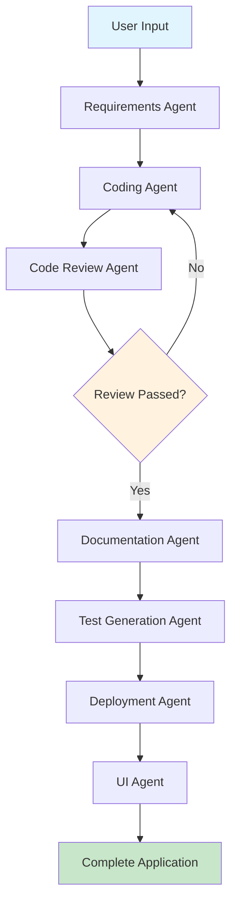

# Multi-Agent Code Generator Framework

🤖 Transform your ideas into complete Python applications using our AI-powered multi-agent system built with AutoGen.

## Overview

This framework uses multiple specialized AI agents to collaboratively develop complete software applications from natural language descriptions. Each agent has a specific role in the software development lifecycle, working together to produce production-ready code, documentation, tests, and deployment configurations.

## Features

- **📋 Requirements Analysis**: Converts natural language into structured software requirements
- **💻 Code Generation**: Creates production-ready Python code with best practices
- **🔍 Code Review**: Automated code review for quality, security, and optimization
- **📚 Documentation**: Comprehensive documentation generation
- **🧪 Test Generation**: Automated test case creation with high coverage
- **🚀 Deployment**: Docker containers and CI/CD pipeline configurations
- **🎨 UI Generation**: Streamlit web interface creation
- **🌐 Web Interface**: Beautiful Streamlit dashboard for easy interaction
- **💻 CLI Interface**: Command-line interface for automation and scripting
- **📊 Real-time Progress**: Dynamic progress tracking with live updates
- **🔄 Agent Monitoring**: Live agent activity and status monitoring
- **📝 Live Logging**: Real-time activity logs with timestamps
- **⏱️ Time Estimation**: Accurate progress and time remaining estimates

## Architecture

### Agent Pipeline



### Specialized Agents

1. **Requirements Analyst**: Analyzes natural language input and creates structured requirements
2. **Python Coder**: Generates high-quality Python code from requirements
3. **Code Reviewer**: Reviews code for quality, security, and best practices
4. **Documentation Writer**: Creates comprehensive documentation
5. **Test Generator**: Generates comprehensive test suites
6. **Deployment Engineer**: Creates deployment configurations and scripts
7. **UI Designer**: Creates Streamlit user interfaces

## Installation

### Prerequisites

- Python 3.8 or higher
- OpenAI API key

### Setup

1. **Clone the repository**:
   ```bash
   git clone <repository-url>
   cd multi-agent-framework
   ```

2. **Install dependencies**:
   ```bash
   pip install -r requirements.txt
   ```

3. **Configure environment variables**:
   Create a `.env` file with your OpenAI configuration:
   ```env
   OPENAI_API_KEY=your_openai_api_key_here
   OPENAI_MODEL=gpt-4o-mini
   ```

4. **Verify installation**:
   ```bash
   python main.py --help
   ```

## Usage

### Web Interface (Recommended)

Launch the Streamlit web interface for the best user experience:

```bash
python main.py web
```

Then open your browser to `http://localhost:8501`

### Command Line Interface

#### Generate an application:
```bash
python main.py generate "Create a web scraper that extracts product information from e-commerce websites"
```

#### With custom project name:
```bash
python main.py generate "Build a REST API for task management" --project-name "task-api"
```

#### View pipeline status:
```bash
python main.py status
```

#### List available agents:
```bash
python main.py agents
```

#### View generation history:
```bash
python main.py history
```

#### Launch web interface:
```bash
python main.py web --host 0.0.0.0 --port 8080
```

### Python API

```python
from core.pipeline import pipeline

# Generate application
results = pipeline.run_pipeline(
    user_input="Create a data analysis tool for CSV files",
    project_name="csv-analyzer"
)

# Access generated components
code = results['code']['final_code']
documentation = results['documentation']['readme']
tests = results['tests']['test_code']
```

## Configuration

### Model Configuration

Customize AI model settings in your `.env` file:

```env
OPENAI_API_KEY=your_api_key
OPENAI_MODEL=gpt-4o-mini
OPENAI_MAX_TOKENS=4000
OPENAI_TEMPERATURE=0.7
OPENAI_BASE_URL=https://api.openai.com/v1  # Optional
OPENAI_ORGANIZATION=your_org_id  # Optional
```

### Agent Configuration

Agent behaviors can be customized in `config/agent_config.py`. Each agent has:
- System message defining its role and responsibilities
- Specialized model configurations
- Interaction parameters

## Output Structure

Generated projects are saved in the `output/` directory with the following structure:

```
output/
└── project_name_timestamp/
    ├── project_results.json      # Complete results
    ├── main.py                   # Generated application code
    ├── README.md                 # Documentation
    ├── test_main.py             # Test cases
    ├── streamlit_app.py         # UI application
    └── deployment.md            # Deployment configurations
```

## Examples

### Data Analysis Tool
```bash
python main.py generate "Create a data analysis tool that reads CSV files, performs statistical analysis, generates visualizations, and exports reports in PDF format"
```

### Web API
```bash
python main.py generate "Build a REST API for a task management system with user authentication, CRUD operations for tasks, and email notifications"
```

### Chatbot
```bash
python main.py generate "Create an intelligent chatbot that can answer questions about a knowledge base, with conversation history and context awareness"
```

## Key Features

### Iterative Code Review
- Automatic code review and improvement cycles
- Security vulnerability detection
- Performance optimization suggestions
- Best practices enforcement

### Comprehensive Testing
- Unit tests with pytest
- Integration tests
- Edge case coverage
- Mock object generation
- >90% code coverage target

### Production-Ready Deployment
- Docker containerization
- CI/CD pipeline configurations
- Environment-specific settings
- Health checks and monitoring

### Interactive UI Generation
- Streamlit web interfaces
- Real-time data visualization
- User-friendly forms and controls
- Responsive design

### Dynamic Progress Tracking
- **Real-time Updates**: Live progress bars and status indicators
- **Step-by-Step Tracking**: Detailed breakdown of each pipeline stage
- **Agent Activity Monitoring**: Visual display of which agents are active
- **Live Logging**: Timestamped activity logs with color-coded levels
- **Time Estimation**: Accurate progress percentage and ETA calculations
- **Substep Details**: Granular progress within each major step
- **Error Handling**: Clear indication of failures with recovery status
- **Visual Indicators**: Color-coded status badges and progress animations

#### Progress Demo
Try the interactive progress demo:
```bash
python demo_progress.py
```

This showcases:
- Multi-step pipeline simulation
- Real-time progress callbacks
- Agent activity monitoring
- Error handling scenarios
- Live logging with timestamps

## Troubleshooting

### Common Issues

1. **OpenAI API Key Error**:
   - Ensure your `.env` file contains a valid `OPENAI_API_KEY`
   - Check that your API key has sufficient credits

2. **Import Errors**:
   - Verify all dependencies are installed: `pip install -r requirements.txt`
   - Check Python version compatibility (3.8+)

3. **Generation Failures**:
   - Use `python main.py status` to check pipeline status
   - Enable verbose mode: `python main.py generate "description" --verbose`

4. **Web Interface Issues**:
   - Ensure port 8501 is available
   - Try a different port: `python main.py web --port 8080`

### Logging

Logs are written to `multi_agent_framework.log` for debugging purposes.

## Development

### Project Structure

```
multi-agent-framework/
├── config/                 # Configuration files
│   ├── agent_config.py    # Agent system messages and behaviors
│   └── model_config.py    # LLM model configurations
├── core/                  # Core framework components
│   ├── agent_manager.py   # Agent coordination and management
│   ├── pipeline.py        # Main pipeline orchestrator
│   └── utils.py          # Utility functions
├── output/               # Generated project outputs
├── .env                 # Environment variables
├── requirements.txt     # Python dependencies
├── main.py             # CLI interface
├── streamlit_app.py    # Web interface
└── README.md           # This file
```

### Adding New Agents

1. Define agent configuration in `config/agent_config.py`
2. Add agent initialization in `core/agent_manager.py`
3. Implement agent workflow in the pipeline
4. Update documentation and tests

### Customizing Workflows

The pipeline can be customized by modifying the `process_user_input` method in `AgentManager`. You can:
- Add new pipeline steps
- Modify agent interactions
- Implement custom validation logic
- Add new output formats

## Contributing

1. Fork the repository
2. Create a feature branch
3. Make your changes
4. Add tests for new functionality
5. Submit a pull request

## License

This project is licensed under the MIT License - see the LICENSE file for details.

## Support

For support and questions:
- Check the troubleshooting section above
- Review the logs in `multi_agent_framework.log`
- Open an issue on GitHub

## Roadmap

- [ ] Support for additional programming languages
- [ ] Integration with more LLM providers
- [ ] Advanced deployment options (Kubernetes, AWS, etc.)
- [ ] Plugin system for custom agents
- [ ] Real-time collaboration features
- [ ] Integration with version control systems
- [ ] Advanced code analysis and metrics

---

**Transform your ideas into reality with AI-powered development!** 🚀
